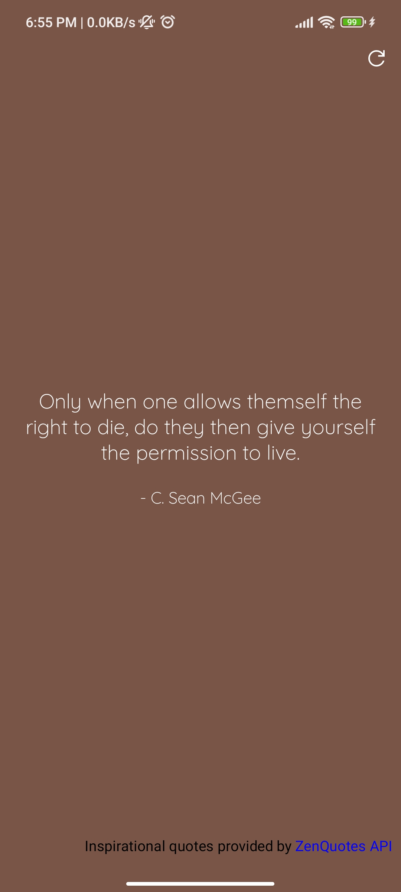

# Quotes

An old pet project in view system with upgraded dependencies, brought back into existence to demonstrate migration to compose.

### Brief about project
* The project uses MVVM architecture.
* The branch [1-view-system](https://github.com/VVFY/Quotes/tree/1-view-system) contains project in view system.
* With the subsequent branch, it shows migration to compose with possible granular steps and readme updates (of course closed PR is a great source).
* Ignore numbers in branch & PR names :)
* Currently the main branch contains everything move dto compose now.

### Screenshots
 
